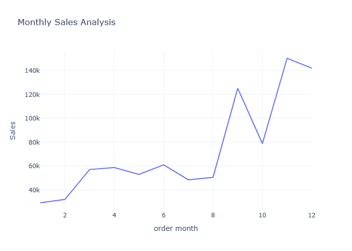
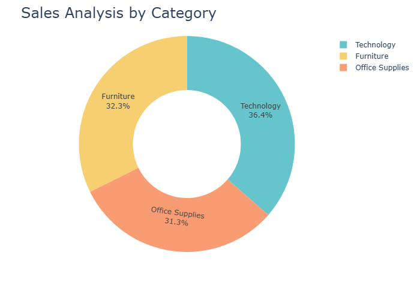
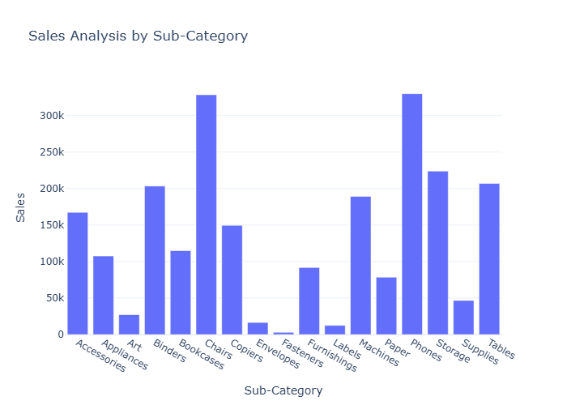
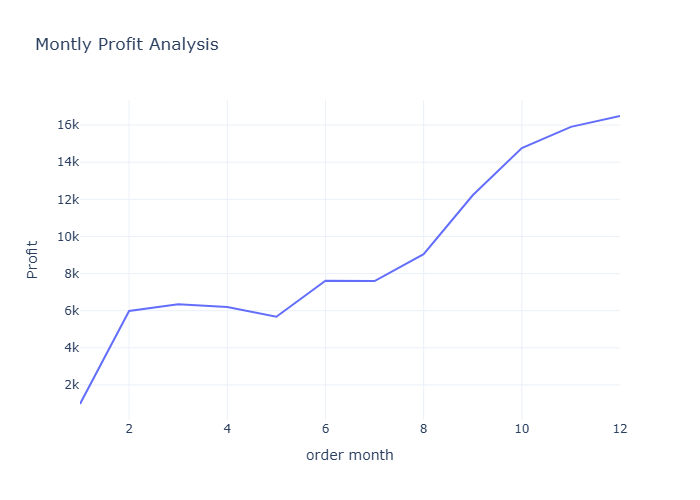
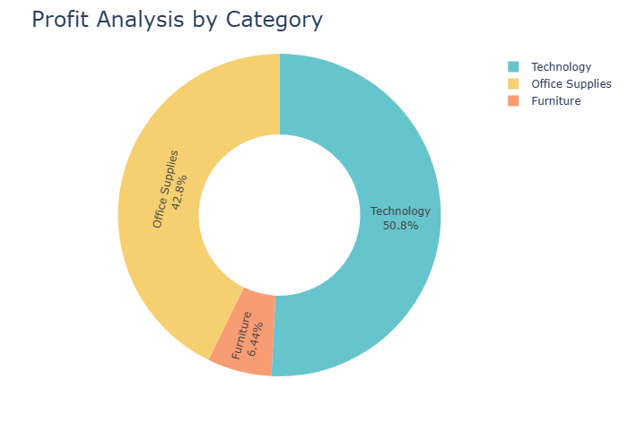
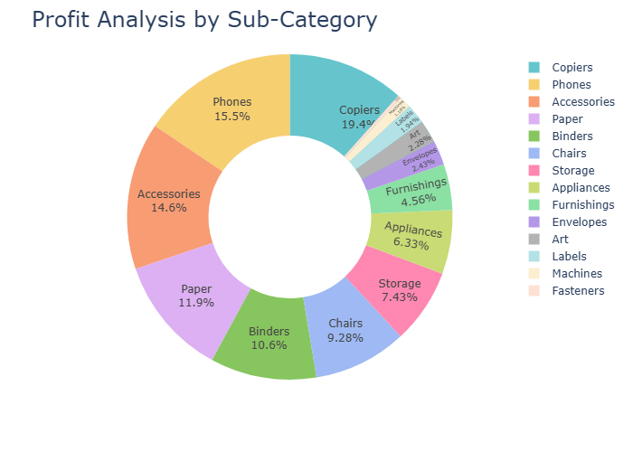
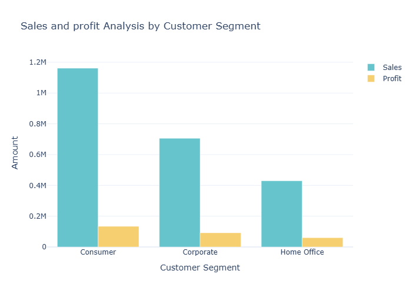
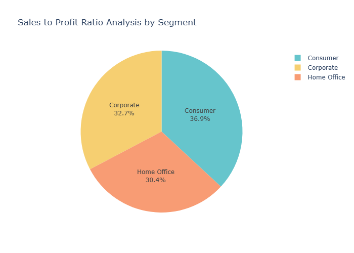

\# 🛒 E-Commerce Sales and Customer Segmentation


\## 📌 Project Overview


This project analyzes e-commerce sales data to understand sales performance, customer behavior, product performance, and customer segments.


The project uses Python, Pandas, plotly, and Streamlit to perform data analysis and create an interactive dashboard.


\## 🛠️ Technologies Used


\- Python

\- Pandas

\-plotly

\- Jupyter Notebook

\- Streamlit


\## 📂 Project Files


\- `E-commerce and Sales.ipynb` - Data cleaning, analysis, EDA, and visualizations

\- `app.py` - Streamlit dashboard application

\- `Sample - Superstore1.csv` - Dataset

\- `requirements.txt` - Required Python libraries

\- `.gitignore` - Files excluded from Git


\## 📊 Key Analysis


\- Sales and profit analysis

\- Category and sub-category performance

\- Regional sales analysis

\- Customer segmentation

\- Top-performing products

\- Sales trends

\- Interactive Streamlit dashboard


\## 🚀 How to Run


Install the required libraries:


```bash

pip install -r requirements.txt

## 📊 Project Visualizations

## 📊 Project Visualizations

### Figure 27


### Figure 42


### Figure 44


### Figure 46


### Figure 47


### Figure 51


### Figure 60


### Figure 73


### Figure 75

